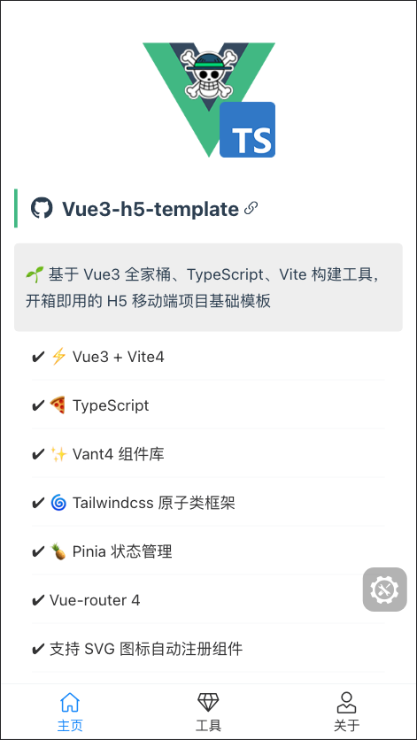
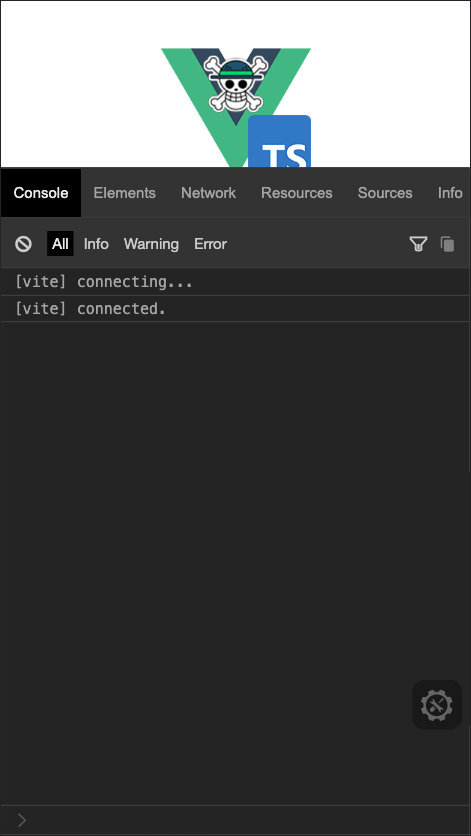

 **🌱 基于 Vue3 全家桶、TypeScript、Vite 构建工具，开箱即用的移动端项目基础模板**

- [x] ⚡ Vue3 + Vite4
- [x] 🍕 TypeScript
- [x] ✨ Vant4 组件库
- [x] 🌀 Tailwindcss 原子类框架
- [x] 🍍 Pinia 状态管理
- [x] Vue-router 4
- [x] 支持 SVG 图标自动注册组件
- [x] vw 视口适配
- [x] Axios 封装
- [x] 打包资源 gzip 压缩
- [x] 开发环境支持 Mock 数据
- [x] ESLint
- [x] 首屏加载动画
- [x] 开发环境调试面板
- [ ] TODO: 生产环境 CDN 依赖


## 在线预览Preview

👓 [点击这里](https://yulimchen.github.io/vue3-h5-template/)（PC浏览器请切换手机端模式）


## 截图




## 运行项目

注意：要求 Node 版本 16+，可使用 [nvm](https://github.com/nvm-sh/nvm#installing-and-updating) 进行本地 Node 版本管理，同时建议使用 [pnpm](https://pnpm.io/zh/installation) 包管理器。

```shell
# 克隆项目
git clone https://github.com/yulimchen/vue3-h5-template.git

# 进入项目目录
cd vue3-h5-template

# 安装依赖
pnpm install

# 启动服务
pnpm dev
```

如果你需要的是基于 `vue-cli(webpack)` 或者 `JavaScript` 构建的 H5 项目模板，可切换到 [vue-cli](https://github.com/yulimchen/vue3-h5-template/tree/vue-cli) 分支进行开发

```shell
# 克隆项目
git clone -b vue-cli https://github.com/yulimchen/vue3-h5-template.git

# 进入项目目录
cd vue3-h5-template

# 安装依赖
yarn

# 启动服务
yarn serve
```


## 文档引导

> - [按需引入 vant 组件](#vant)
> - [SVG 图标使用](#svg)
> - [路由缓存 & 命名注意 ⚠](#router)
> - [调试面板 eruda](#console)
> - [动态设置页面标题](#page-title)
> - [vw 视口适配](#viewport)
> - [Tailwindcss 原子类框架](#tailwindcss)
> - [Git 提交信息规范](#git)
> - [CDN 加载依赖](#CDN)


### - <span id="vant">按需引入 vant 组件</span>

全量引入组件库太过臃肿，项目中使用 `unplugin-vue-components` 插件进行按需自动引入组件，可通过[官方文档](https://vant-ui.github.io/vant/#/zh-CN/quickstart#2.-pei-zhi-cha-jian)了解更多。


### - <span id="svg">SVG 图标使用</span>


> 1. 将 svg 图标文件放在 `src/icons/svg` 目录下
> 2. 在项目中直接使用 `<svg-icon name="svg图标文件命名" />` 即可

例如：

本项目 `src/icons/svg` 中放了个叫 `check-in.svg` 的图标文件，然后在组件 `name` 属性中填入文件的命名即可，So easy~


```Vue
<svg-icon name="check-in" />
```

> 项目中使用了 `unplugin-vue-components` 自动引入组件，所以 `main.ts` 中无需注册全局图标组件。


### - <span id="router">路由缓存 & 命名注意 ⚠</span>

组件默认开启缓存，如某个组件需关闭缓存，在对应路由 `meta` 内的 `noCache` 字段赋值为 `true` 即可。

```typescript
// src/router/routes.ts
const routes: Array<RouteRecordRaw> = [
    // ...
    {
        path: "about",
        name: "About",
        component: () => import("@/views/about/index.vue"),
        meta: {
            title: "关于",
            noCache: true
        }
    }
];
```

 为了保证页面能被正确缓存，请确保**组件**的 `name` 值和对应路由的 `name` 命名完全相同。

```vue
<!-- src/views/about/index.vue -->
<script setup lang="ts" name="About">
	// 使用了 `vite-plugin-vue-setup-extend` 插件，可在 `setup` 语法糖标签上添加 `name` 属性为组件命名
</script>

<template>
  <div>about</div>
</template>
```


### - <span id="console">调试面板 eruda</span>



为了方便移动端查看 log 信息和调试，开发环境引入了 eruda 调试面板的 cdn。如果你的开发环境不需要的话请在 `.env.development` 中修改值

```html
# .env.development

# 开发环境启用 cdn eruda 调试工具。若不启用，将 true 修改为 false 或其他任意值即可
VITE_ENABLE_ERUDA = "true"
```


### - <span id="page-title">动态设置页面标题</span>

在路由全局前置守卫中：

```js
// src/router/index.ts
// ...
router.beforeEach((to: toRouteType, from, next) => {
  // ...
  // 页面 title
  setPageTitle(to.meta.title);
  next();
});
```

具体实现方法见文件 `src/utils/set-page-title.ts` 。


### - <span id="mock">开发环境 Mock</span>

> 本项目开发环境支持 mock 请求数据，在 `mock` 目录中可配置接口和数据，具体见[文档](https://github.com/pengzhanbo/vite-plugin-mock-dev-server/blob/main/README.zh-CN.md)。


### - <span id="viewport">vw 视口适配</span>

使用 `cnjm-postcss-px-to-viewport` 进行视口适配，相关配置见项目根目录下 `postcss.config.js`。

```js
// postcss.config.js
module.exports = {
  plugins: {
    // 使用 cnjm-postcss-px-to-viewport 规避 postcss.plugin was deprecated 警告
    "cnjm-postcss-px-to-viewport": {
      viewportWidth: 375, // 根据设计稿设定
      minPixelValue: 1, // 最小的转换数值
      unitPrecision: 2 // 转化精度，转换后保留位数
    },
    autoprefixer: {
      overrideBrowserslist: ["Android >= 4.0", "iOS >= 7"]
    }
  }
};
```


### - <span id="tailwindcss">Tailwindcss 原子类框架</span>

Tailwindcss 从 3.0 版本开始默认使用 `JIT` 模式，打包代码不再臃肿，结合 `vite` 使用非常香~ 如果你还没使用过类似的框架，Tailwindcss 首页的[示例](https://tailwindcss.com/)非常直观。

官方文档：https://tailwindcss.com/docs/padding


### - <span id="git">Git 提交信息规范</span>

项目使用 `husky` 规范 Git 提交信息，遵循社区主流的 [Angular](https://github.com/conventional-changelog/conventional-changelog/tree/master/packages/conventional-changelog-angular) 规范。

```
feat 增加新功能
fix 修复问题/BUG
style 代码风格相关无影响运行结果的
perf 优化/性能提升
refactor 重构
revert 撤销修改
test 测试相关
docs 文档/注释
chore 依赖更新/脚手架配置修改等
workflow 工作流改进
ci 持续集成
types 类型定义文件更改
wip 开发中
```

```
// 格式
<type>(<scope>): <subject>
// 示例
feat(layout): 布局完成
```


### - <span id="CDN">CDN 生产环境依赖(TODO)</span>

本模板生产环境默认 CDN 加载依赖，依赖加载源见根目录 `dependencies-cdn.js` 文件。

**❗ PS.为避免打包后出现不可预估问题，请注意确保生产和开发环境的依赖版本一致！**

> 如需关闭 CDN 依赖，在根目录生产环境变量文件 `.env.production` 中修改 `VUE_APP_CDN_DEPS` 的值为 `false` ，重新打包即可。


## 鸣谢

 [vue-element-admin](https://github.com/PanJiaChen/vue-element-admin) 

 [vant-demo](https://github.com/youzan/vant-demo) 

 [vue-pure-admin](https://github.com/xiaoxian521/vue-pure-admin)

 [vue-vben-admin](https://github.com/vbenjs/vue-vben-admin)


## License

[MIT license](https://github.com/yulimchen/vue3-h5-template/blob/master/LICENSE).